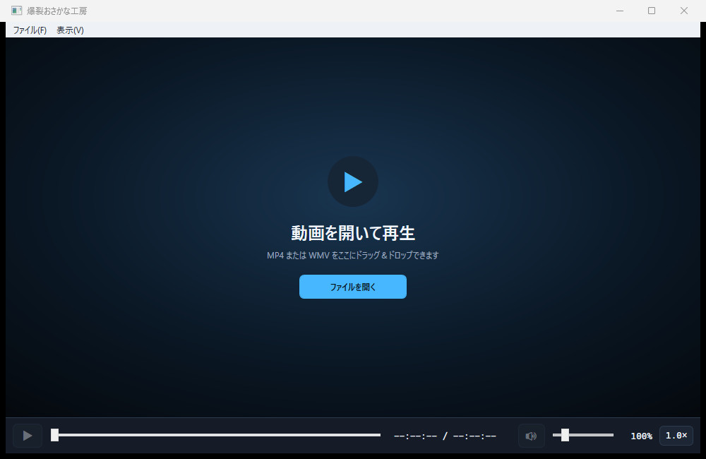
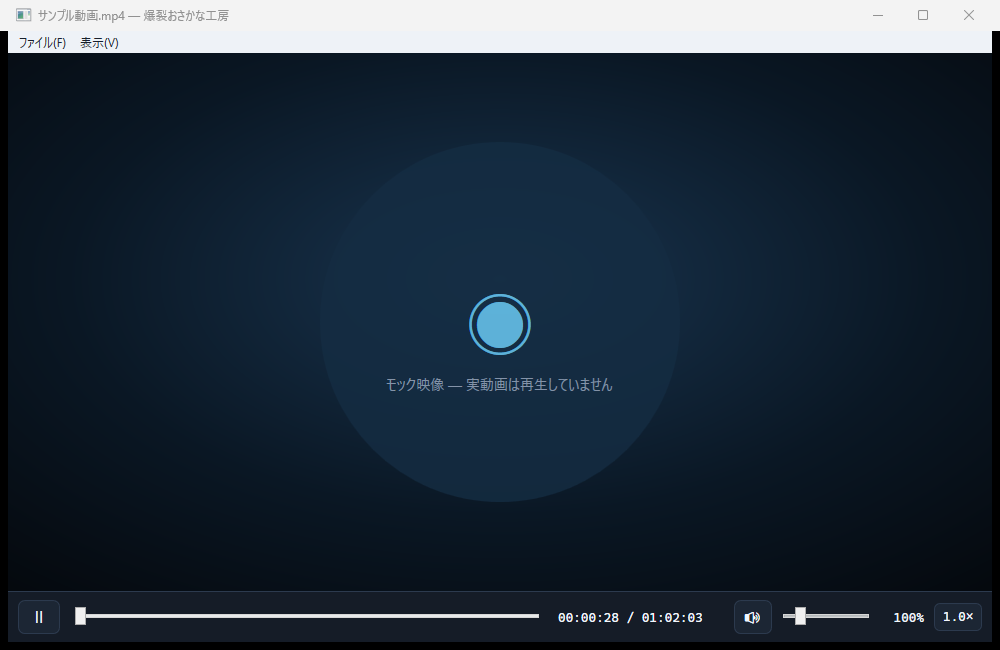
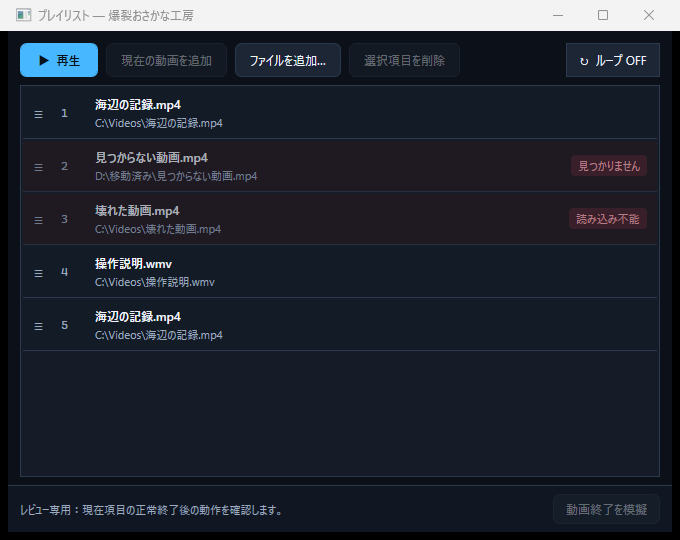

# 爆裂おさかな工房 UI実装リファレンス

版: 1.0（Phase 3確定版）
最終更新日: 2026-08-08
状態: Phase 3完了・開発者承認済み
参照: `docs/phase3/ui-design.md`、`docs/specifications/specs.md`

## 1. この文書の使い方

Phase 4で製品UIを実装するときの外観、配置、状態差、操作フィードバックの基準をまとめる。機能要件と例外規則の正は`docs/specifications/specs.md`、レビュー経緯と状態モデルの正は`docs/phase3/ui-design.md`とし、この文書は実装時に素早く参照するための要約と代表画像を提供する。

画像は`prototypes/Phase3UiMock`で確定したPhase 3モックである。画像内の模擬映像やデータは製品資産ではない。レビュー操作パネル、状態切替、異常発生、動画終了模擬などのレビュー専用UIは製品へ含めない。

## 2. 画面構成

| 画面 | 初期サイズ | 最小サイズ | 実装上の要点 |
| --- | ---: | ---: | --- |
| メインウィンドウ | 1000×650 | 720×480 | メニューバー、動画領域、1段の再生コントローラーを隙間なく縦に配置する |
| プレイリスト | 680×540 | 560×400 | メインとは独立したウィンドウとし、上部操作、一覧、ループ操作を表示する |

ウィンドウ外周や、メニュー・動画領域・コントローラーの間に装飾目的のパディングを設けない。通常画面では独立したステータスバーを表示せず、動画ファイル名は`ファイル名 - 爆裂おさかな工房`の形式でタイトルバーに表示する。

### 2.1 動画未選択

- 動画領域中央に「ファイルを開く」ボタンとドラッグ&ドロップ案内を表示する。
- 再生、シーク、音量など動画を必要とする操作を無効にし、理由をツールチップで示す。
- 時刻は`--:--:-- / --:--:--`とする。
- 動画領域左上の状態バッジ、コントローラー内の状態説明やファイル名は表示しない。

### 2.2 再生中

- 動画領域は利用可能な範囲いっぱいに表示し、状態説明を重ねない。
- コントローラーは左から、再生・一時停止、シークバー、現在時刻/全体時間、ミュート、音量、音量値、速度の順で1段に配置する。
- シークバーのトラックは、再生ボタンと時刻表示の視覚中心へ縦位置を揃える。
- 再生中は一時停止アイコン、一時停止中は再生アイコンを表示する。状態を示す別バッジは置かない。

### 2.3 プレイリスト

- 上部に「再生」「現在の動画を追加」「ファイルを追加」「選択項目を削除」とループ切替を置く。
- 一覧には順番、ファイル名、パス、現在再生中、欠損・読込エラー状態を表示する。同じ動画の重複登録を許可する。
- 欠損項目は赤系の表示と文字、現在再生中の項目は青系の表示と文字で識別する。
- ドラッグ中はファイル名付きの半透明ゴーストと青い挿入位置ラインを表示する。項目の上半分は手前、下半分は後ろへの挿入を表す。
- 削除は選択した登録だけを対象とし、元ファイルを削除しない。

## 3. 状態とフィードバック

| 状態 | 動画領域 | コントローラー | フィードバック |
| --- | --- | --- | --- |
| 未選択 | 開く操作とドロップ案内 | 動画依存操作を無効化 | 無効理由のツールチップ |
| 読み込み中 | 中央に読み込み表示とファイル名 | 再生、シーク、音量を無効化 | 時刻は不明表示 |
| 再生中 | 動画を表示 | 一時停止アイコン、シーク可 | タイトルバーにファイル名 |
| 一時停止中 | 現在フレームを維持 | 再生アイコン、シーク可 | タイトルバーにファイル名 |
| 開く前に判別できるエラー | 既存動画があれば維持し、なければ空状態 | 既存動画の操作可否を維持 | 右上の短いエラー通知 |
| 再生途中のエラー | 最後の有効フレームと時刻を維持 | 動画依存操作を無効化 | 画面内エラーと「別の動画を開く」 |
| 保存不能・保存データ復旧 | 再生を継続 | 操作を妨げない | 右上の警告通知 |

通知には原因と次の行動だけを簡潔に表示する。パス、例外、スタックトレースなどの内部情報は表示せず、ログへ記録する。状態は色だけに依存せず、文字とアイコンを併用する。

## 4. メニューとファイル導線

- 「ファイル」には、開く、最近開いたファイル、データフォルダーを開く、終了を置く。
- 「表示」には、プレイリストとサムネイル設定を置く。レビュー操作パネルは製品では除外する。
- 「最近開いたファイル」は存在する項目を選ぶと開き、欠損項目は無効表示にする。
- 欠損履歴の削除は個別項目を子メニューへ表示し、2件以上なら末尾に「すべて削除」を加える。これは欠損履歴だけを削除する。
- 「履歴をすべて消去」は存在・欠損を問わず履歴登録だけを削除し、元ファイルには影響しない。
- メインウィンドウへのドロップは1ファイルだけ受け付ける。複数ファイルは状態を変えず、1ファイルだけ指定するよう通知する。

## 5. 再生操作とジェスチャー

- シーク、時刻、音量、ミュート、速度は横1段に保ち、ウィンドウ幅が狭い場合も動画領域より優先して操作可能性を維持する。
- 動画領域上のホイールは1ノッチ5%で音量を変更し、0～500%へクランプする。
- 動画領域の右クリックメニューから0.25、0.5、1.0、1.5、2.0倍速、現在位置の再生開始位置登録、フルスクリーンを操作する。
- 左クリック400ms長押しで押している間だけ2.0倍速とし、解放またはフォーカス喪失で元速度へ戻す。発動前にドラッグ判定距離を超えた場合は長押しを取り消す。
- ダブルクリック、`Alt+Enter`、右クリックメニューでフルスクリーンを切り替える。全画面中は`Esc`でも解除する。
- フルスクリーンではマウス移動でコントローラーを表示し、3秒の無操作後に隠す。コントローラー上と右クリックメニュー操作中は隠さない。
- 入力要素へフォーカスがある場合は標準キー操作を優先する。ただし`Alt+Enter`と全画面中の`Esc`は常に扱う。

## 6. シーク補助

- シークバーホバー位置の8px上へ、240×135の画像と時刻行を含むポップアップを表示する。左右端ではシークバー幅内へクランプし、マウス操作を受け取らない。
- 未生成位置では待機表示を出し、動画を開いた直後から設定間隔ごとのサムネイルをバックグラウンドで事前生成する。主再生と操作応答を優先し、オンデマンド生成も補助として残す。
- 生成間隔は既定1.0%、範囲0.25～5.0%、刻み0.25%とし、変更は次に開く動画から適用する。設定UIに推定枚数を表示しない。
- 登録済み再生開始位置はシークバー上のマーカーで示す。登録操作後は短い通知を表示する。

Phase 3モックのサムネイル内に表示される`0.25%`などの値は生成スロットを確認するための模擬表示であり、製品UIの画像内テキストではない。

## 7. プレイリスト動作

- 「再生」は選択状態に関係なく先頭の再生可能項目から開始し、ダブルクリックは対象項目から開始する。
- 正常終了後は欠損・読込不能項目を飛ばす。末尾ではループOFFなら停止し、ONなら先頭へ戻る。
- 再生可能項目がない場合は停止し、案内は一度だけ表示する。
- メインウィンドウから別動画を開いた場合はプレイリスト連続再生を解除する。
- プレイリストはPhase 4で永続化する。画像下部の動画終了模擬操作はレビュー専用であり、製品では表示しない。

## 8. テーマ、DPI、アクセシビリティ

- 利用者向けテーマは固定ダークとする。主要な通常文字、補助文字、操作、エラー表示は背景とのコントラスト比4.5:1以上を維持する。
- Per-Monitor DPIへ追従し、100%と150%のディスプレイ間で論理サイズとレイアウトを維持する。
- Tab移動時は青いフォーカス枠を表示する。主要ウィンドウ、再生、シーク、時刻、音量、速度、プレイリスト、通知へ支援技術向けの名前・説明を設定する。
- Windows高コントラスト専用配色はPhase 3の確定範囲に含めず、Phase 4の製品実装後に必要性と対応範囲を再評価する。

## 9. Phase 4への実装境界

Phase 3で確定したのはUI構造、状態差、操作規則、フィードバックである。実動画再生、LibVLC/NAudio連携、ファイル・設定・プロファイル・プレイリストの永続化、単一起動IPC、実サムネイル生成、配布物はPhase 4で実装・検証する。製品実装で技術的制約が判明した場合は、黙って外観や操作を変更せず、仕様・影響・代替案を記録して再確認する。
